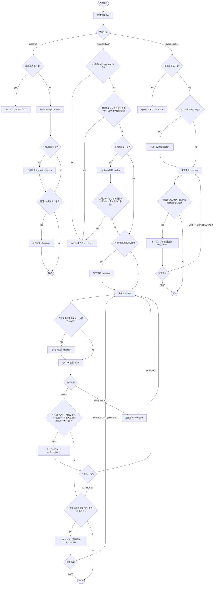
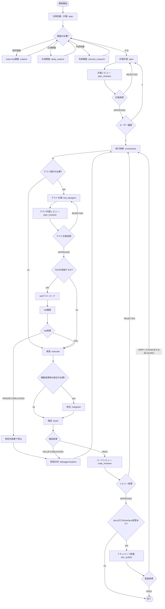

# opencode config


## セットアップ(ubuntu)

```bash
mkdir -p ~/.config/opencode
ln -s ~/prompts/opencode/AGENTS.md      ~/.config/opencode/AGENTS.md
ln -s ~/prompts/opencode/opencode.json  ~/.config/opencode/opencode.json
```

## opencode.json の編集について

**`opencode.json` を直接編集しないでください。** 以下の同期スクリプトを使用してください。

### プロンプトの同期

`prompts/*.md` の `## Prompt` 以降が source of truth です。編集後に同期します。

```bash
./sync_prompts.sh
```

### モデルの同期

`models.tsv` が source of truth です。編集後に同期します。

```bash
./sync_models.sh           # 同期実行
./sync_models.sh --dry-run  # 変更内容の確認のみ
```

直接 `opencode.json` の `model` / `small_model` / `agent.*.model` / `agent.*.prompt` を編集しても、次回同期時に上書きされます。

## Model Context Protocol (MCP)

`opencode.json` には Chrome DevTools を利用するための MCP サーバー設定 (`chrome-devtools-mcp`) が組み込まれています。
これにより、AIエージェントがローカルのChromeブラウザを開き、UIの操作やコンソールの確認、ネットワークやDOMの検証を行うことが可能になります。

### 使い方
`opencode` を起動するだけで MCP サーバーが自動的に立ち上がります。AIエージェントに対して「Chromeブラウザで〇〇を確認して」と指示を出すことで、バックグラウンド連携された DevTools プロトコル経由で検証が実行されます。

## エージェント別フロー図

`fast` と `spec` では入口もゲートも異なるため、概要図ではなく実行順が分かる形で分けて掲載します。

### Fast フロー



### Spec フロー



補足:
- `spec` はユーザー向けの窓口のままで、`y` 承認後は `orchestrator` のチェックポイントを中継しながら自動実行を継続します。
- `deep_explore` は `spec` 段階専用で、実行フェーズの `orchestrator` からは呼びません。
- `test_designer` が test-spec を作成した場合は、実装前に必ず独立した `plan_reviewer` のテスト計画レビューを通します。
- TDD の想定外結果は自動リトライせず、`debugger` に委譲して `NEEDS_INPUT` を返します。

## エージェント構成

> **モデルの変更は `models.tsv` を編集し `./sync_models.sh` で同期してください。`opencode.json` を直接編集しないでください。**

### 1. クイック実行フェーズ（メイン：fast）
- **fast (Primary)**: 単発のコード調査・小さな実装変更・ドキュメント生成/更新向けの高速エージェント。依頼を `research / implementation / documentation` に分類し、実装系では `INTENT: fix | feature | refactor` と `NEEDS_DEBUGGER: yes | no` を付けた上で、必要最小限のサブエージェントへ委譲する。（モデル: `anthropic/claude-sonnet-4-6`）
- `fast` は軽量経路を優先し、`code_reviewer` と `doc_auditor` は常設ではなく条件付きで起動する。TDD やテスト設計（`test_designer` / `plan_reviewer`）は `fast` では行わず、必要な場合は `spec` へエスカレーションする。

### 2. 仕様策定と計画フェーズ（メイン：spec）
- **spec (Primary)**: 仕様策定・計画専任。ユーザー要求を「意思決定済みの実行可能計画」に変換し、計画成果物のみを作成する。（モデル: `anthropic/claude-opus-4-6`）
- **explore (Subagent)**: 共通のコードベース調査（read-only）。`fast` / `spec` / `orchestrator` が、対象ファイルの実装詳細・制御フロー・インターフェース・局所的な実装慣習を確認するために使う。（モデル: `google/gemini-3.1-flash-lite-preview`）
- **deep_explore (Subagent)**: `spec` 段階専用の大規模・横断的コードベース調査。膨大なコードベースから依存関係、アーキテクチャ、実装慣習を把握し、計画に必要な前提を固めるために使う。（モデル: `openai/gpt-5.3-codex`）
- **internet_research (Subagent)**: 外部リサーチ。ローカル調査で不足する外部知識のみを対象に、情報源付きで調査する。（モデル: `google/gemini-3.1-flash-lite-preview`）
- **plan_reviewer (Subagent)**: 計画書と test-spec の厳格レビュー。仕様・計画レビューとテスト計画レビューの両方で `STATUS: APPROVED | REJECTED` を返す独立ゲート判定役。（モデル: `openai/gpt-5.3-codex`）
- `plan_reviewer` は別案を作る役ではなく、計画の抜け漏れ、実行可能性、テスト設計の妥当性を採点するチェック役として扱う。

### 3. 実装オーケストレーション/統合フェーズ（司令塔：orchestrator / 呼び出し元：spec）
- **orchestrator (Subagent)**: 実行制御とゲート管理（司令塔）。`spec` から自動的に呼び出され、承認済み計画をタスクに分解し、フェーズ順序と次に呼ぶサブエージェントを決める。プロダクトコードは編集しない。（モデル: `opencode/glm-5`）
- `orchestrator` は司令塔であり、プロダクトコードの探索も直接行わない。追加のローカル事実が必要な場合は `explore` に委譲し、広域アーキテクチャ理解が不足している場合は実行中に `deep_explore` で補わず `spec` に戻して計画を補正する。
- **executor (Subagent)**: 単一タスクの実装担当。`mode: surgical`（局所修正）と `mode: investigative`（必要最小限の調査込み実装）をタスクマニフェストで切り替える。（モデル: `opencode/kimi-k2.5`）
- **integrator (Subagent)**: 複数成果物の統合作業。変更の接着、競合解消、型/インターフェース整合を担当する。（モデル: `anthropic/claude-sonnet-4-6`）
- **debugger (Subagent)**: 原因分析専任。失敗シグナルや再現結果を受けて根本原因分析を行い、証拠ベースのレポートを作成する。（モデル: `openai/gpt-5.3-codex`）
- **test_designer (Subagent)**: テスト仕様設計。中〜高リスク変更、TDD、またはテスト方針が曖昧な場合に先に review-ready な test-spec を作成し、その後 `plan_reviewer` の独立レビューに渡す。（モデル: `anthropic/claude-sonnet-4-6`）

### 4. 検証と監査フェーズ
- **tester (Subagent)**: テスト実行と結果報告。テスト実行、失敗再現、回帰確認を担当し、`STATUS: PASS | FAIL | BLOCKED` で返す。（モデル: `openai/gpt-5.1-codex-mini`）
- **code_reviewer (Subagent)**: コードレビュー。`STATUS: APPROVED | REJECTED` と重大度順 findings を返す。（モデル: `openai/gpt-5.3-codex`）
- `code_reviewer` は review package ベースでレビューし、探索役を兼ねない。文脈不足時は自力探索せず、必要な差分/補足文脈を差し戻す。
- **doc_auditor (Subagent)**: ドキュメント乖離監査。公開インターフェースや文書化済み挙動に変化がある場合に実行し、`STATUS: PASS | DRIFT_FOUND | BLOCKED` と更新指示書を返す。（モデル: `openai/gpt-5.3-codex`）

## ワークフローと「関所」

このフローには、暴走防止と速度の両立を意図した「関所」と「経路」があります。
ユーザーとの対話窓口は `fast`（単発・高速）または `spec`（計画主導）の primary エージェントで、`spec` の計画承認後の実装移行は内部で自動的に行われます。

### 実行経路（Path）

- **fast-path**: `R0`（小さく明確な変更）向け。ローカル調査中心で最小限の計画を作成し、ユーザー承認後に実装へ進む。
- **fast primary lane (`fast`)**: 単発の調査・小さな実装・ドキュメント生成向け。依頼を `research / implementation / documentation` に分類し、`implementation` では `fix / feature / refactor` を副属性で扱いながら `explore` / `debugger` / `executor` / `tester` / `code_reviewer` / `doc_auditor` などへ最小委譲し、必要なゲートだけを条件付きで実行する。
  - `fast` はリポジトリ調査（ファイル探索・コード読取・構造確認）を自前で行わず、`explore`（または再現調査が必要な場合は `debugger`）へ委譲する。
  - 広域な依存関係・アーキテクチャ・実装慣習の把握が必要になった場合、`fast` では抱え込まず `spec` に上げて `deep_explore` を使う。
  - `fast` では tiny な単一ファイル修正に対して reviewer/doc audit を常時積まず、変更リスク・公開面影響・ユーザー要求に応じて起動する。
- **strict-path**: `R1+`、要件不明確、外部知識が必要な変更向け。ドラフト/最終計画・レビュー・検証ゲートを厳格に踏む。
- 計画主導経路（`fast-path` / `strict-path`）では、ユーザーは `spec` に対して `y/n` で承認するだけでよく、`orchestrator` への切り替え操作は不要。

### 標準フロー（新構成 / `spec` 主導）

補足: 調査サブエージェントの使い分け
- `explore`: 対象ファイルの実装詳細を確認するための調査役。`spec` / `fast` / `orchestrator` が使う。
- `deep_explore`: `spec` 段階専用の広域調査役。大規模コードベースの依存関係、アーキテクチャ、実装慣習を把握するために使う。
- 実装フェーズに入った後で広域理解が不足していると判明した場合は、`orchestrator` が `deep_explore` を呼ばず、`BLOCKED` / `NEEDS_INPUT` として計画側に戻して補う。

1. **初期調査（read-only）**: `spec` が `explore` を使って対象ファイルの事実を収集し、必要に応じて `deep_explore` で広域アーキテクチャや実装慣習を把握する（`spec` 自身はリポジトリ調査を直接行わない）。
2. **仕様の明確化（Specification Gate）**: 目的、範囲、制約、成功条件を確定する。曖昧さが残る間は実装へ進まない。
3. **外部知識の確認（Knowledge Gate / 条件付き）**: ローカル調査で不足する場合のみ `internet_research` を使う。
4. **計画作成（spec）**: `spec` が `.agents/plans/` に計画成果物（draft/final plan、必要なら補足）を作成する。
5. **計画レビュー（Review Gate）**: `plan_reviewer` が `STATUS: APPROVED | REJECTED` で判定する。
6. **ユーザー承認（User Approval Gate）**: 計画を提示し、`y/n` で明示的な承認を得るまで停止する。
7. **自動移行とフェーズ制御（orchestrator）**: ユーザーが `y` を返したら、`spec` が `orchestrator` を自動的に呼び出す。`orchestrator` はチェックポイント型（短い段階実行）でフェーズ順序・次に呼ぶサブエージェント・ゲート進行を決め、各チェックポイントを `spec` が中継する。
8. **テスト仕様設計（条件付き / 先行）**: TDD、中〜高リスク変更、またはテスト方針が不明な場合に `test_designer` が先に test-spec を作成する。
9. **テスト計画レビュー（独立ゲート / 条件付き）**: `test_designer` が test-spec を作成・更新した場合、`plan_reviewer` が独立したテスト計画レビューを行う。`REJECTED` の場合は `test_designer` に差し戻し、`APPROVED` になるまで実装へ進まない。
10. **TDD 実行（条件付き）**: TDD の場合は、承認済み test-spec に基づいて `executor`（テストコード / red phase）→ `tester`（FAIL=期待値）→ `executor`（実装 / green phase）→ `tester`（PASS=期待値）の順で進める。red phase で `tester` が PASS した場合（予期しない）、または green phase で `tester` が FAIL した場合（予期しない）は、いずれも実行を停止し `debugger` に委譲してレポートを作成し `NEEDS_INPUT` を返す。自動リトライは行わない。
11. **実装と統合**: 単一タスクの変更は `executor`、複数成果物の接着・競合解消は `integrator` が担当する。
12. **検証と監査（最終ゲート）**: `tester` を実装前後または実装後に必要な順序で実行し、その後 `code_reviewer`、必要時のみ `doc_auditor` を逐次実行して完了とする。

### 主要な関所（Gate）

- **Specification Gate**: 意図・範囲・成功条件が明確で、計画が意思決定済みであること。
- **Knowledge Gate（条件付き）**: 外部知識が必要な場合のみ `internet_research` を使用すること。`spec` / `fast` のローカル調査は原則 `explore` 委譲とする。
- **User Approval Gate**: `spec` 主導では実装前にユーザーの明示承認があること（`fast` は R0/小さなR1で依頼自体を承認として扱える）。
- **Auto Handoff Rule**: `y` 承認後は `spec` が `orchestrator` に自動委譲し、ユーザーに手動切り替えを要求しないこと。
- **Checkpoint Progress Gate**: `spec`→`orchestrator`→各サブエージェントのネスト時は、`orchestrator` が `IN_PROGRESS` で段階的に返却し、`spec` が都度中継すること。長時間の無言ネスト実行を避ける。
- **Test Plan Review Gate（条件付き）**: `test_designer` が作成した test-spec は、実装前に `plan_reviewer` の独立レビューで `APPROVED` されていること。
- **Sequential Verification Gate**: `tester` / `code_reviewer` / `doc_auditor` は同一依頼内で並列化せず、統合済みスコープを確定してから 1 ゲートずつ進めること。
- **Test-First Gate（条件付き）**: TDD の場合は、`test_designer` と `plan_reviewer` で test-spec を固めてから `executor`（テストコード / red phase）→ `tester`（FAIL=期待値）→ `executor`（実装 / green phase）→ `tester`（PASS=期待値）の順を優先すること。red phase で `tester` が PASS した場合（予期しない）、または green phase で `tester` が FAIL した場合（予期しない）は、いずれも halt → `debugger` 委譲 → `.agents/reports/` にレポート → `NEEDS_INPUT` とする。自動リトライ不可。
- **Review Gate**: reviewer/tester の `STATUS` が成功状態であること。
- **Role Separation Gate**: `spec` と `orchestrator` はプロダクトコードを編集しないこと。`spec` / `fast` はリポジトリ調査を自前で行わず、`explore`（必要に応じて `debugger`）を使うこと。
- **Exploration Ownership Gate**: 局所的なリポジトリ探索（grep/glob ベースの発見・横断読取）と対象ファイルの詳細実装確認は `explore` の役割とし、`orchestrator` と `code_reviewer` は必要な事実を委譲または受領して扱うこと。広域な依存追跡・影響範囲分析・アーキテクチャ把握・実装慣習の整理は `spec` 段階でのみ `deep_explore` に委譲すること。
- **Boundary Gate**: `executor` は単一タスク実装、`integrator` は複数成果物の接着、`tester` は検証、`debugger` は原因分析、`plan_reviewer` は実装計画と test-spec のゲート判定に責務を限定すること。

## 出力契約（Gate判定用）

レビュー/検証系エージェントは、機械判定しやすい `STATUS` を必ず含めます。

- `plan_reviewer`: `REVIEW_KIND: IMPLEMENTATION_PLAN | TEST_SPEC`, `STATUS: APPROVED | REJECTED`
- `code_reviewer`: `STATUS: APPROVED | REJECTED`
- `tester`: `STATUS: PASS | FAIL | BLOCKED`
- `doc_auditor`: `STATUS: PASS | DRIFT_FOUND | BLOCKED`
- `debugger`: `STATUS: REPRODUCED | NOT_REPRODUCED | BLOCKED`
- `orchestrator`: `STATUS: IN_PROGRESS | COMPLETED | BLOCKED | NEEDS_INPUT`
- `executor` / `integrator` / `test_designer`: `STATUS: COMPLETED | BLOCKED`

## 成果物ディレクトリ

### 運用原則

- 成果物は必要になった時点で遅延作成する。空ディレクトリや未使用ファイルを先回りして作らない。
- 同一依頼の同一目的物は、履歴を分ける必要がない限り既存ファイルを更新して使う。
- 削除方針は「証跡として残すべきものは保持、実行再開のためだけのものは依頼終了時に掃除」を原則とする。
- 進行中の依頼、`BLOCKED`、`NEEDS_INPUT` の依頼にひもづく成果物は削除しない。

### ディレクトリ別ルール

- `.agents/plans/`
  - 形式: `.md` のみ。計画書、ドラフト、final plan、test-spec を Markdown で管理する。
  - 作成: `spec` が計画ドラフト/最終計画を作る時、または `test_designer` が test-spec を作る時。
  - 削除: 原則保持する。削除してよいのは、同一依頼内で新しい draft/final/test-spec に完全に置き換わり、かつレビューや実行が古い版を参照していない時、またはユーザーが明示的にクリーンアップを指示した時。
- `.agents/tasks/`
  - 形式: `.md` のみ。人間が読めるタスクマニフェストとして保持する。
  - 作成: `orchestrator` が承認済み計画を実行単位へ分解した時。
  - 削除: その依頼が `COMPLETED` になって再開の必要がなくなった時、または依頼が明示的に中止されて最初からやり直すことが確定した時。`BLOCKED` / `NEEDS_INPUT` の間は保持する。
- `.agents/state/`
  - 形式: `.json` または `.md`。再開用の機械可読状態は `.json`、補助的な進行メモや人間向けの状態説明は `.md` を使う。
  - 作成: `orchestrator` がチェックポイント再開や進行管理のために永続状態を持つ必要が生じた時。
  - 削除: `.agents/tasks/` と同じ。再開の可能性がある間は削除しない。
- `.agents/reports/`
  - 形式: `.md` のみ。デバッグ、テスト失敗、ドキュメント乖離などの証跡を Markdown で残す。
  - 作成: `debugger` が調査結果を残す時、`tester` が失敗や保存すべき証拠を残す時、`doc_auditor` が乖離レポートを出す時など、証拠保全が必要になった時。
  - 削除: 原則保持する。関連する問題が解消され、以後の判断材料として参照しないことが明確になった時、またはユーザーが明示的にクリーンアップを指示した時に削除してよい。
- `.agents/research/`
  - 形式: `.md` のみ。出典付きの外部調査結果を Markdown で残す。
  - 作成: `internet_research` が外部調査を実行した時。
  - 削除: 原則保持する。新しい調査結果に完全に置き換わった時、またはユーザーが明示的にクリーンアップを指示した時に削除してよい。

### まとめ

- 長く残す: `.agents/plans/`, `.agents/reports/`, `.agents/research/`
- 依頼終了後に掃除対象: `.agents/tasks/`, `.agents/state/`
