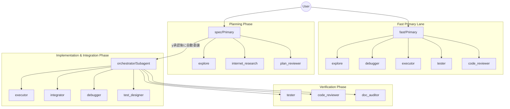

# opencode config


## symlink(ubuntu)
```bash
ln -s ~/Dev/Tools/prompts/opencode/AGENTS.md  ~/.config/opencode
ln -s ~/Dev/Tools/prompts/opencode/opencode.json ~/.config/opencode
ln -s ~/Dev/Tools/prompts/opencode/prompts ~/.config/opencode/prompts
```
## opencode-sync-prompts(~/.local/bin/opencode-sync-prompts)

`prompts/*.md` を prompt の真実源（source of truth）として扱い、`opencode.json` の `agent.*.prompt` を同期するシェルスクリプトです。
agent の prompt を変更する場合は、先に `prompts/` 配下を編集してから同期してください。

```bash
#!/usr/bin/env bash
set -euo pipefail

CONFIG="${HOME}/.config/opencode/opencode.json"
PROMPTS_DIR="${HOME}/.config/opencode/prompts"
tmp="$(mktemp)"

if [[ ! -f "${CONFIG}" ]]; then
  echo "Config not found: ${CONFIG}" >&2
  exit 1
fi

if [[ ! -d "${PROMPTS_DIR}" ]]; then
  echo "Prompts directory not found: ${PROMPTS_DIR}" >&2
  exit 1
fi

if ! command -v jq >/dev/null 2>&1; then
  echo "jq is required but not installed" >&2
  exit 1
fi

trap 'rm -f "${tmp}"' EXIT

# jq 引数とフィルタの組み立て
ARGS=()
FILTER='.'
updated=0

# Markdownファイルごとにプロンプトを抽出して jq 引数に追加
for f in "${PROMPTS_DIR}"/*.md; do
  [[ -f "$f" ]] || continue

  name=$(basename "$f" .md)

  if ! jq -e --arg name "$name" '.agent[$name] != null' "${CONFIG}" >/dev/null; then
    echo "Skip unknown agent markdown: ${f}" >&2
    continue
  fi
  
  # ## Prompt 以降を抽出し、先頭・末尾の空行を削除
  content=$(awk '
    BEGIN {in_prompt=0}
    /^## Prompt[[:space:]]*$/ {in_prompt=1; next}
    in_prompt {print}
  ' "$f")

  content=$(printf '%s\n' "$content" | sed '/./,$!d' | tac | sed '/./,$!d' | tac)

  if [[ -z "$content" ]]; then
    echo "Skip empty prompt body: ${f}" >&2
    continue
  fi
  
  ARGS+=(--arg "p_${name}" "$content")
  FILTER+=" | .agent[\"${name}\"].prompt = \$p_${name}"
  updated=$((updated + 1))
done

if [[ "$updated" -eq 0 ]]; then
  echo "No prompts were updated. Ensure markdown files contain a '## Prompt' section and match agent keys." >&2
  exit 1
fi

# jq を一回だけ実行して更新
jq "${ARGS[@]}" "$FILTER" "${CONFIG}" > "${tmp}"

mv "${tmp}" "${CONFIG}"
echo "Synced all prompts from ${PROMPTS_DIR} into ${CONFIG}"
```

## Model Context Protocol (MCP)

`opencode.json` には Chrome DevTools を利用するための MCP サーバー設定 (`chrome-devtools-mcp`) が組み込まれています。
これにより、AIエージェントがローカルのChromeブラウザを開き、UIの操作やコンソールの確認、ネットワークやDOMの検証を行うことが可能になります。

### 使い方
`opencode` を起動するだけで MCP サーバーが自動的に立ち上がります。AIエージェントに対して「Chromeブラウザで〇〇を確認して」と指示を出すことで、バックグラウンド連携された DevTools プロトコル経由で検証が実行されます。

## エージェント間連携図



## エージェント構成

### 1. クイック実行フェーズ（メイン：fast）
- **fast (Primary)**: 単発のコード修正・コード調査・小さな実装変更向けの高速エージェント。依頼を `bug_fix / research / coding` に分類し、必要最小限のサブエージェントへ委譲する。（モデル: `google/gemini-3.1-pro-preview-customtools`）

### 2. 仕様策定と計画フェーズ（メイン：spec）
- **spec (Primary)**: 仕様策定・計画専任。ユーザー要求を「意思決定済みの実行可能計画」に変換し、計画成果物のみを作成する。（モデル: `google/gemini-3.1-pro-preview-customtools`）
- **explore (Subagent)**: コードベース調査（read-only）。計画やデバッグのための事実確認を行う。（モデル: `google/antigravity-gemini-3-flash-preview`）
- **internet_research (Subagent)**: 外部リサーチ。ローカル調査で不足する外部知識のみを対象に、情報源付きで調査する。（モデル: `google/gemini-3-flash-preview`）
- **plan_reviewer (Subagent)**: 計画書/テスト仕様書の厳格レビュー。`STATUS: APPROVED | REJECTED` を返すゲート判定役。（モデル: `openai/gpt-5.2-codex`）

### 3. 実装オーケストレーション/統合フェーズ（司令塔：orchestrator / 呼び出し元：spec）
- **orchestrator (Subagent)**: 実行制御とゲート管理（司令塔）。`spec` から自動的に呼び出され、承認済み計画をタスクに分解し、実装・統合・検証・監査を委譲する。プロダクトコードは編集しない。（モデル: `opencode/glm-5`）
- **executor (Subagent)**: 統合実装エージェント。`mode: surgical`（局所修正）と `mode: investigative`（調査込み実装）をタスクマニフェストで切り替える。（モデル: `opencode/kimi-k2.5`）
- **integrator (Subagent)**: 並列タスクの統合作業。変更の接着、競合解消、整合性調整を担当する。（モデル: `openai/gpt-5.2-codex`）
- **debugger (Subagent)**: バグ調査・再現・根本原因分析。証拠ベースのレポートを作成し、修正方針の材料を提供する。（モデル: `openai/gpt-5.2-codex`）
- **test_designer (Subagent)**: テスト仕様設計。中〜高リスク変更やテスト方針が曖昧な場合に test-spec を作成する。（モデル: `google/antigravity-claude-opus-4-6-thinking`）

### 4. 検証と監査フェーズ
- **tester (Subagent)**: テスト実行と結果報告。`STATUS: PASS | FAIL | BLOCKED` でゲート判定可能な形式で返す。（モデル: `openai/gpt-5.2-codex`）
- **code_reviewer (Subagent)**: コードレビュー。`STATUS: APPROVED | REJECTED` と重大度順 findings を返す。（モデル: `openai/gpt-5.2-codex`）
- **doc_auditor (Subagent)**: ドキュメント乖離監査。`STATUS: PASS | DRIFT_FOUND | BLOCKED` と更新指示書を返す。（モデル: `openai/gpt-5.2-codex`）

## ワークフローと「関所」

このフローには、暴走防止と速度の両立を意図した「関所」と「経路」があります。
ユーザーとの対話窓口は `fast`（単発・高速）または `spec`（計画主導）の primary エージェントで、`spec` の計画承認後の実装移行は内部で自動的に行われます。

### 実行経路（Path）

- **fast-path**: `R0`（小さく明確な変更）向け。ローカル調査中心で最小限の計画を作成し、ユーザー承認後に実装へ進む。
- **fast primary lane (`fast`)**: 単発の修正・調査・小さな実装向け。依頼を分類して `explore` / `debugger` / `executor` などへ最小委譲し、必要な検証ゲートのみ実行する。
  - `fast` はリポジトリ調査（ファイル探索・コード読取・構造確認）を自前で行わず、`explore`（または再現調査が必要な場合は `debugger`）へ委譲する。
- **strict-path**: `R1+`、要件不明確、外部知識が必要な変更向け。ドラフト/最終計画・レビュー・検証ゲートを厳格に踏む。
- 計画主導経路（`fast-path` / `strict-path`）では、ユーザーは `spec` に対して `y/n` で承認するだけでよく、`orchestrator` への切り替え操作は不要。

### 標準フロー（新構成 / `spec` 主導）

1. **初期調査（read-only）**: `spec` が `explore` を使い、コードベースの事実を収集する（`spec` 自身はリポジトリ調査を直接行わない）。
2. **仕様の明確化（Specification Gate）**: 目的、範囲、制約、成功条件を確定する。曖昧さが残る間は実装へ進まない。
3. **外部知識の確認（Knowledge Gate / 条件付き）**: ローカル調査で不足する場合のみ `internet_research` を使う。
4. **計画作成（spec）**: `spec` が `.agents/plans/` に計画成果物（draft/final plan、必要なら補足）を作成する。
5. **ユーザー承認（User Approval Gate）**: 計画を提示し、`y/n` で明示的な承認を得るまで停止する。
6. **計画レビュー（Review Gate）**: `plan_reviewer` が `STATUS: APPROVED | REJECTED` で判定する。
7. **自動移行とタスク分割（orchestrator）**: ユーザーが `y` を返したら、`spec` が `orchestrator` を自動的に呼び出す。`orchestrator` はチェックポイント型（短い段階実行）でタスクマニフェスト作成・委譲・ゲート進行を行い、各チェックポイントを `spec` が中継する。
8. **統合作業（必要時）**: 並列タスクの接着・競合解消は `integrator` が担当する。
9. **テスト仕様設計（条件付き）**: 中〜高リスク変更、またはテスト方針が不明な場合に `test_designer` が test-spec を作成する。
10. **検証と監査（最終ゲート）**: `tester`、`code_reviewer`、`doc_auditor` を実行し、各 `STATUS` が成功状態であることを確認して完了とする。

### 主要な関所（Gate）

- **Specification Gate**: 意図・範囲・成功条件が明確で、計画が意思決定済みであること。
- **Knowledge Gate（条件付き）**: 外部知識が必要な場合のみ `internet_research` を使用すること。`spec` / `fast` のローカル調査は原則 `explore` 委譲とする。
- **User Approval Gate**: `spec` 主導では実装前にユーザーの明示承認があること（`fast` は R0/小さなR1で依頼自体を承認として扱える）。
- **Auto Handoff Rule**: `y` 承認後は `spec` が `orchestrator` に自動委譲し、ユーザーに手動切り替えを要求しないこと。
- **Checkpoint Progress Gate**: `spec`→`orchestrator`→各サブエージェントのネスト時は、`orchestrator` が `IN_PROGRESS` で段階的に返却し、`spec` が都度中継すること。長時間の無言ネスト実行を避ける。
- **Review Gate**: reviewer/tester の `STATUS` が成功状態であること。
- **Role Separation Gate**: `spec` と `orchestrator` はプロダクトコードを編集しないこと。`spec` / `fast` はリポジトリ調査を自前で行わず、`explore`（必要に応じて `debugger`）を使うこと。

## 出力契約（Gate判定用）

レビュー/検証系エージェントは、機械判定しやすい `STATUS` を必ず含めます。

- `plan_reviewer`: `STATUS: APPROVED | REJECTED`
- `code_reviewer`: `STATUS: APPROVED | REJECTED`
- `tester`: `STATUS: PASS | FAIL | BLOCKED`
- `doc_auditor`: `STATUS: PASS | DRIFT_FOUND | BLOCKED`
- `debugger`: `STATUS: REPRODUCED | NOT_REPRODUCED | BLOCKED`
- `orchestrator`: `STATUS: IN_PROGRESS | COMPLETED | BLOCKED | NEEDS_INPUT`
- `executor` / `integrator` / `test_designer`: `STATUS: COMPLETED | BLOCKED`

## 成果物ディレクトリ

- `.agents/plans/`: 計画書、test-spec
- `.agents/tasks/`: タスクマニフェスト
- `.agents/state/`: 実行状態や進行管理メモ
- `.agents/reports/`: テスト失敗、デバッグ、ドキュメント乖離レポート
- `.agents/research/`: 外部リサーチ結果
