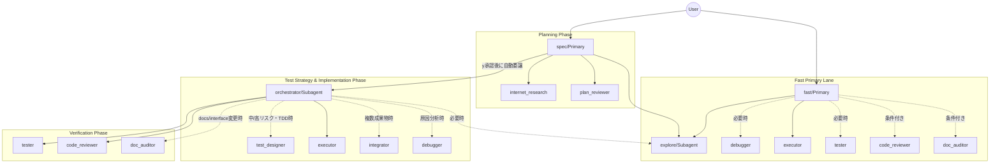

# opencode config


## symlink(ubuntu)
```bash
ln -s ~/Dev/Tools/prompts/opencode/AGENTS.md  ~/.config/opencode
ln -s ~/Dev/Tools/prompts/opencode/opencode.json ~/.config/opencode
ln -s ~/Dev/Tools/prompts/opencode/prompts ~/.config/opencode/prompts
```
## opencode-sync-prompts(~/.local/bin/opencode-sync-prompts)

`prompts/*.md` を prompt の真実源（source of truth）として扱い、`opencode.json` の `agent.*.prompt` を同期するシェルスクリプトです。
agent の prompt を変更する場合は、先に `prompts/` 配下を編集してから同期してください。

```bash
#!/usr/bin/env bash
set -euo pipefail

CONFIG="${HOME}/.config/opencode/opencode.json"
PROMPTS_DIR="${HOME}/.config/opencode/prompts"
tmp="$(mktemp)"

if [[ ! -f "${CONFIG}" ]]; then
  echo "Config not found: ${CONFIG}" >&2
  exit 1
fi

if [[ ! -d "${PROMPTS_DIR}" ]]; then
  echo "Prompts directory not found: ${PROMPTS_DIR}" >&2
  exit 1
fi

if ! command -v jq >/dev/null 2>&1; then
  echo "jq is required but not installed" >&2
  exit 1
fi

trap 'rm -f "${tmp}"' EXIT

# jq 引数とフィルタの組み立て
ARGS=()
FILTER='.'
updated=0

# Markdownファイルごとにプロンプトを抽出して jq 引数に追加
for f in "${PROMPTS_DIR}"/*.md; do
  [[ -f "$f" ]] || continue

  name=$(basename "$f" .md)

  if ! jq -e --arg name "$name" '.agent[$name] != null' "${CONFIG}" >/dev/null; then
    echo "Skip unknown agent markdown: ${f}" >&2
    continue
  fi
  
  # ## Prompt 以降を抽出し、先頭・末尾の空行を削除
  content=$(awk '
    BEGIN {in_prompt=0}
    /^## Prompt[[:space:]]*$/ {in_prompt=1; next}
    in_prompt {print}
  ' "$f")

  content=$(printf '%s\n' "$content" | sed '/./,$!d' | tac | sed '/./,$!d' | tac)

  if [[ -z "$content" ]]; then
    echo "Skip empty prompt body: ${f}" >&2
    continue
  fi
  
  ARGS+=(--arg "p_${name}" "$content")
  FILTER+=" | .agent[\"${name}\"].prompt = \$p_${name}"
  updated=$((updated + 1))
done

if [[ "$updated" -eq 0 ]]; then
  echo "No prompts were updated. Ensure markdown files contain a '## Prompt' section and match agent keys." >&2
  exit 1
fi

# jq を一回だけ実行して更新
jq "${ARGS[@]}" "$FILTER" "${CONFIG}" > "${tmp}"

mv "${tmp}" "${CONFIG}"
echo "Synced all prompts from ${PROMPTS_DIR} into ${CONFIG}"
```

## Model Context Protocol (MCP)

`opencode.json` には Chrome DevTools を利用するための MCP サーバー設定 (`chrome-devtools-mcp`) が組み込まれています。
これにより、AIエージェントがローカルのChromeブラウザを開き、UIの操作やコンソールの確認、ネットワークやDOMの検証を行うことが可能になります。

### 使い方
`opencode` を起動するだけで MCP サーバーが自動的に立ち上がります。AIエージェントに対して「Chromeブラウザで〇〇を確認して」と指示を出すことで、バックグラウンド連携された DevTools プロトコル経由で検証が実行されます。

## エージェント間連携図



## エージェント構成

### 1. クイック実行フェーズ（メイン：fast）
- **fast (Primary)**: 単発のコード調査・小さな実装変更・ドキュメント生成/更新向けの高速エージェント。依頼を `research / implementation / documentation` に分類し、実装系では `INTENT: fix | feature | refactor` と `NEEDS_DEBUGGER: yes | no` を付けた上で、必要最小限のサブエージェントへ委譲する。（モデル: `openai/gpt-5.4`）
- `fast` は軽量経路を優先し、`code_reviewer` と `doc_auditor` は常設ではなく条件付きで起動する。

### 2. 仕様策定と計画フェーズ（メイン：spec）
- **spec (Primary)**: 仕様策定・計画専任。ユーザー要求を「意思決定済みの実行可能計画」に変換し、計画成果物のみを作成する。（モデル: `openai/gpt-5.4`）
- **explore (Subagent)**: 共通のコードベース調査（read-only）。`fast` / `spec` / `orchestrator` が必要なローカル事実確認を委譲する。（モデル: `google/gemini-3.1-flash-lite-preview`）
- **internet_research (Subagent)**: 外部リサーチ。ローカル調査で不足する外部知識のみを対象に、情報源付きで調査する。（モデル: `google/gemini-3.1-flash-lite-preview`）
- **plan_reviewer (Subagent)**: 計画書/テスト仕様書の厳格レビュー。`STATUS: APPROVED | REJECTED` を返すゲート判定役。（モデル: `github-copilot/claude-opus-4.6`）
- `plan_reviewer` は別案を作る役ではなく、計画の抜け漏れと実行可能性を採点するチェック役として扱う。

### 3. 実装オーケストレーション/統合フェーズ（司令塔：orchestrator / 呼び出し元：spec）
- **orchestrator (Subagent)**: 実行制御とゲート管理（司令塔）。`spec` から自動的に呼び出され、承認済み計画をタスクに分解し、フェーズ順序と次に呼ぶサブエージェントを決める。プロダクトコードは編集しない。（モデル: `openai/gpt-5.4`）
- `orchestrator` は司令塔であり、プロダクトコードの探索も直接行わない。追加のローカル事実が必要な場合は `explore` に委譲する。
- **executor (Subagent)**: 単一タスクの実装担当。`mode: surgical`（局所修正）と `mode: investigative`（必要最小限の調査込み実装）をタスクマニフェストで切り替える。（モデル: `opencode/kimi-k2.5`）
- **integrator (Subagent)**: 複数成果物の統合作業。変更の接着、競合解消、型/インターフェース整合を担当する。（モデル: `opencode/glm-5`）
- **debugger (Subagent)**: 原因分析専任。失敗シグナルや再現結果を受けて根本原因分析を行い、証拠ベースのレポートを作成する。（モデル: `openai/gpt-5.3-codex`）
- **test_designer (Subagent)**: テスト仕様設計。中〜高リスク変更、TDD、またはテスト方針が曖昧な場合に先に test-spec を作成する。（モデル: `github-copilot/claude-opus-4.6`）

### 4. 検証と監査フェーズ
- **tester (Subagent)**: テスト実行と結果報告。テスト実行、失敗再現、回帰確認を担当し、`STATUS: PASS | FAIL | BLOCKED` で返す。（モデル: `openai/gpt-5.1-codex-mini`）
- **code_reviewer (Subagent)**: コードレビュー。`STATUS: APPROVED | REJECTED` と重大度順 findings を返す。（モデル: `openai/gpt-5.3-codex`）
- `code_reviewer` は review package ベースでレビューし、探索役を兼ねない。文脈不足時は自力探索せず、必要な差分/補足文脈を差し戻す。
- **doc_auditor (Subagent)**: ドキュメント乖離監査。公開インターフェースや文書化済み挙動に変化がある場合に実行し、`STATUS: PASS | DRIFT_FOUND | BLOCKED` と更新指示書を返す。（モデル: `openai/gpt-5.3-codex`）

## ワークフローと「関所」

このフローには、暴走防止と速度の両立を意図した「関所」と「経路」があります。
ユーザーとの対話窓口は `fast`（単発・高速）または `spec`（計画主導）の primary エージェントで、`spec` の計画承認後の実装移行は内部で自動的に行われます。

### 実行経路（Path）

- **fast-path**: `R0`（小さく明確な変更）向け。ローカル調査中心で最小限の計画を作成し、ユーザー承認後に実装へ進む。
- **fast primary lane (`fast`)**: 単発の調査・小さな実装・ドキュメント生成向け。依頼を `research / implementation / documentation` に分類し、`implementation` では `fix / feature / refactor` を副属性で扱いながら `explore` / `debugger` / `executor` / `tester` / `code_reviewer` / `doc_auditor` などへ最小委譲し、必要なゲートだけを条件付きで実行する。
  - `fast` はリポジトリ調査（ファイル探索・コード読取・構造確認）を自前で行わず、`explore`（または再現調査が必要な場合は `debugger`）へ委譲する。
  - `fast` では tiny な単一ファイル修正に対して reviewer/doc audit を常時積まず、変更リスク・公開面影響・ユーザー要求に応じて起動する。
- **strict-path**: `R1+`、要件不明確、外部知識が必要な変更向け。ドラフト/最終計画・レビュー・検証ゲートを厳格に踏む。
- 計画主導経路（`fast-path` / `strict-path`）では、ユーザーは `spec` に対して `y/n` で承認するだけでよく、`orchestrator` への切り替え操作は不要。

### 標準フロー（新構成 / `spec` 主導）

1. **初期調査（read-only）**: `spec` が `explore` を使い、コードベースの事実を収集する（`spec` 自身はリポジトリ調査を直接行わない）。
2. **仕様の明確化（Specification Gate）**: 目的、範囲、制約、成功条件を確定する。曖昧さが残る間は実装へ進まない。
3. **外部知識の確認（Knowledge Gate / 条件付き）**: ローカル調査で不足する場合のみ `internet_research` を使う。
4. **計画作成（spec）**: `spec` が `.agents/plans/` に計画成果物（draft/final plan、必要なら補足）を作成する。
5. **ユーザー承認（User Approval Gate）**: 計画を提示し、`y/n` で明示的な承認を得るまで停止する。
6. **計画レビュー（Review Gate）**: `plan_reviewer` が `STATUS: APPROVED | REJECTED` で判定する。
7. **自動移行とフェーズ制御（orchestrator）**: ユーザーが `y` を返したら、`spec` が `orchestrator` を自動的に呼び出す。`orchestrator` はチェックポイント型（短い段階実行）でフェーズ順序・次に呼ぶサブエージェント・ゲート進行を決め、各チェックポイントを `spec` が中継する。
8. **テスト仕様設計（条件付き / 先行）**: 中〜高リスク変更、TDD、またはテスト方針が不明な場合に `test_designer` が先に test-spec を作成する。
9. **実装と統合**: 単一タスクの変更は `executor`、複数成果物の接着・競合解消は `integrator` が担当する。
10. **検証と監査（最終ゲート）**: `tester` を実装前後または実装後に必要な順序で実行し、その後 `code_reviewer`、必要時のみ `doc_auditor` を逐次実行して完了とする。

### 主要な関所（Gate）

- **Specification Gate**: 意図・範囲・成功条件が明確で、計画が意思決定済みであること。
- **Knowledge Gate（条件付き）**: 外部知識が必要な場合のみ `internet_research` を使用すること。`spec` / `fast` のローカル調査は原則 `explore` 委譲とする。
- **User Approval Gate**: `spec` 主導では実装前にユーザーの明示承認があること（`fast` は R0/小さなR1で依頼自体を承認として扱える）。
- **Auto Handoff Rule**: `y` 承認後は `spec` が `orchestrator` に自動委譲し、ユーザーに手動切り替えを要求しないこと。
- **Checkpoint Progress Gate**: `spec`→`orchestrator`→各サブエージェントのネスト時は、`orchestrator` が `IN_PROGRESS` で段階的に返却し、`spec` が都度中継すること。長時間の無言ネスト実行を避ける。
- **Sequential Verification Gate**: `tester` / `code_reviewer` / `doc_auditor` は同一依頼内で並列化せず、統合済みスコープを確定してから 1 ゲートずつ進めること。
- **Test-First Gate（条件付き）**: TDD または中〜高リスク変更では、`test_designer` で期待挙動を固めてから `tester` → `executor` → `tester` の順を優先すること。
- **Review Gate**: reviewer/tester の `STATUS` が成功状態であること。
- **Role Separation Gate**: `spec` と `orchestrator` はプロダクトコードを編集しないこと。`spec` / `fast` はリポジトリ調査を自前で行わず、`explore`（必要に応じて `debugger`）を使うこと。
- **Exploration Ownership Gate**: リポジトリ探索（grep/glob ベースの発見・横断読取）は `explore` の役割とし、`orchestrator` と `code_reviewer` は必要な事実を委譲または受領して扱うこと。
- **Boundary Gate**: `executor` は単一タスク実装、`integrator` は複数成果物の接着、`tester` は検証、`debugger` は原因分析、`plan_reviewer` は計画採点に責務を限定すること。

## 出力契約（Gate判定用）

レビュー/検証系エージェントは、機械判定しやすい `STATUS` を必ず含めます。

- `plan_reviewer`: `STATUS: APPROVED | REJECTED`
- `code_reviewer`: `STATUS: APPROVED | REJECTED`
- `tester`: `STATUS: PASS | FAIL | BLOCKED`
- `doc_auditor`: `STATUS: PASS | DRIFT_FOUND | BLOCKED`
- `debugger`: `STATUS: REPRODUCED | NOT_REPRODUCED | BLOCKED`
- `orchestrator`: `STATUS: IN_PROGRESS | COMPLETED | BLOCKED | NEEDS_INPUT`
- `executor` / `integrator` / `test_designer`: `STATUS: COMPLETED | BLOCKED`

## 成果物ディレクトリ

### 運用原則

- 成果物は必要になった時点で遅延作成する。空ディレクトリや未使用ファイルを先回りして作らない。
- 同一依頼の同一目的物は、履歴を分ける必要がない限り既存ファイルを更新して使う。
- 削除方針は「証跡として残すべきものは保持、実行再開のためだけのものは依頼終了時に掃除」を原則とする。
- 進行中の依頼、`BLOCKED`、`NEEDS_INPUT` の依頼にひもづく成果物は削除しない。

### ディレクトリ別ルール

- `.agents/plans/`
  - 形式: `.md` のみ。計画書、ドラフト、final plan、test-spec を Markdown で管理する。
  - 作成: `spec` が計画ドラフト/最終計画を作る時、または `test_designer` が test-spec を作る時。
  - 削除: 原則保持する。削除してよいのは、同一依頼内で新しい draft/final/test-spec に完全に置き換わり、かつレビューや実行が古い版を参照していない時、またはユーザーが明示的にクリーンアップを指示した時。
- `.agents/tasks/`
  - 形式: `.md` のみ。人間が読めるタスクマニフェストとして保持する。
  - 作成: `orchestrator` が承認済み計画を実行単位へ分解した時。
  - 削除: その依頼が `COMPLETED` になって再開の必要がなくなった時、または依頼が明示的に中止されて最初からやり直すことが確定した時。`BLOCKED` / `NEEDS_INPUT` の間は保持する。
- `.agents/state/`
  - 形式: `.json` または `.md`。再開用の機械可読状態は `.json`、補助的な進行メモや人間向けの状態説明は `.md` を使う。
  - 作成: `orchestrator` がチェックポイント再開や進行管理のために永続状態を持つ必要が生じた時。
  - 削除: `.agents/tasks/` と同じ。再開の可能性がある間は削除しない。
- `.agents/reports/`
  - 形式: `.md` のみ。デバッグ、テスト失敗、ドキュメント乖離などの証跡を Markdown で残す。
  - 作成: `debugger` が調査結果を残す時、`tester` が失敗や保存すべき証拠を残す時、`doc_auditor` が乖離レポートを出す時など、証拠保全が必要になった時。
  - 削除: 原則保持する。関連する問題が解消され、以後の判断材料として参照しないことが明確になった時、またはユーザーが明示的にクリーンアップを指示した時に削除してよい。
- `.agents/research/`
  - 形式: `.md` のみ。出典付きの外部調査結果を Markdown で残す。
  - 作成: `internet_research` が外部調査を実行した時。
  - 削除: 原則保持する。新しい調査結果に完全に置き換わった時、またはユーザーが明示的にクリーンアップを指示した時に削除してよい。

### まとめ

- 長く残す: `.agents/plans/`, `.agents/reports/`, `.agents/research/`
- 依頼終了後に掃除対象: `.agents/tasks/`, `.agents/state/`
